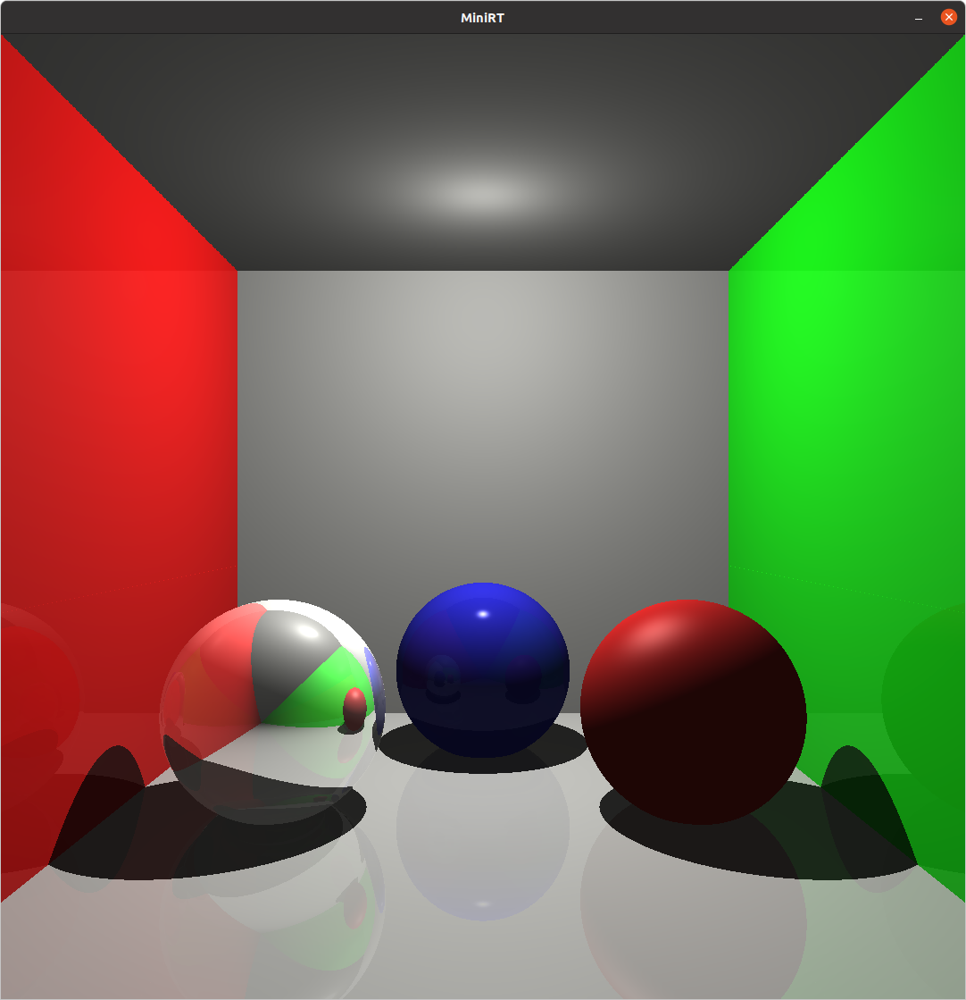

# Structure of a .rt file

The .rt input files for MiniRT receive parameters for the lights, cameras and polygons that compose a scene. Each element must have it's parameters written in a specific order, and separated only by spaces. They can have one or more line breaks between them, and can be declared in any order. They all must be preceded by their specific identifying header.

---------

### Screen resolution
**Header:** R

**Screen Width:** Integer between 1 and the limit of your screen resolution.

**Screen Height:** Integer between 1 and the limit of your screen resolution.

---------

### Ambient light
**Header:** A

**Light Intensity:** Double between 0.0 and 1.0.

**Color:** Three integers between 0 and 255.

---------

### Camera
**Header:** c

**Position:** Three doubles representing X,Y,Z coordinates.

**View direction:** Three doubles representing normalized direction vectors between -1.0 and 1.0.

**Field of Vision:** One integer between 0 and 180, representing the camera's focal length.

---------

### Point light
**Header:** l

**Position:** Three doubles representing X,Y,Z coordinates.

**Light Intensity:** Double between 0.0 and 1.0.

**Color:** Three integers between 0 and 255.

---------

### Sphere
**Header:** sp

**Center:** Three doubles representing X,Y,Z coordinates.

**Diameter:** Double larger than 0.0.

**Color:** Three integers between 0 and 255.

**Specular reflection (optional):** Double between 0.0 and 1.0.

**Shininess (optional):** Double between 0.0 and 500.0.

**Reflectivity (optional):** Double between 0.0 and 1.0.

---------

### Plane
**Header:** pl

**Origin point:** Three doubles representing X,Y,Z coordinates.

**Direction:** Three doubles representing normalized direction vectors between -1.0 and 1.0.

**Color:** Three integers between 0 and 255.

**Specular reflection (optional):** Double between 0.0 and 1.0.

**Shininess (optional):** Double between 0.0 and 500.0.

**Reflectivity (optional):** Double between 0.0 and 1.0.

---------

### Square
**Header:** sq

**Center:** Three doubles representing X,Y,Z coordinates.

**Direction:** Three doubles representing normalized direction vectors between -1.0 and 1.0.

**Size of side:** Double larger than 0.0.

**Color:** Three integers between 0 and 255.

**Specular reflection (optional):** Double between 0.0 and 1.0.

**Shininess (optional):** Double between 0.0 and 500.0.

**Reflectivity (optional):** Double between 0.0 and 1.0.

---------

### Cylinder
**Header:** cy

**Center:** Three doubles representing X,Y,Z coordinates.

**Direction:** Three doubles representing normalized direction vectors between -1.0 and 1.0.

**Diameter:** Double larger than 0.0.

**Height:** Double larger than 0.0.

**Color:** Three integers between 0 and 255.

**Specular reflection (optional):** Double between 0.0 and 1.0.

**Shininess (optional):** Double between 0.0 and 500.0.

**Reflectivity (optional):** Double between 0.0 and 1.0.

---------

### Triangle
**Header:** tr

**Point 1:** Three doubles representing X,Y,Z coordinates.

**Point 2:** Three doubles representing X,Y,Z coordinates.

**Point 3:** Three doubles representing X,Y,Z coordinates.

**Color:** Three integers between 0 and 255.

**Specular reflection (optional):** Double between 0.0 and 1.0.

**Shininess (optional):** Double between 0.0 and 500.0.

**Reflectivity (optional):** Double between 0.0 and 1.0.

---------

### Bounce lighting recursion limiter (optional)
**Header:** bn

**Number of light "bounces":** One integer between 0 and 12

---------

# Example scene

This example file:

```
R   400    400

A   0.1    255,255,200

c   0,1,-13   0,0,1   60

l   0,5,0   0.8    255,255,255

l   0,0,8   0.2    255,255,255

pl  0,-3,0  0,1,0  200,200,200   0   100   0.1

pl  0,6,0  0,1,0  200,200,200    0    100   0

pl  5,0,0  1,0,0  25,255,25    0    100    0.1

pl  -5,0,0  1,0,0  255,25,25   0   100   0.1

pl  0,0,4  0,0,1  200,200,200   0   100   0

sp  0,-1.1,1   3   50,50,255   0.9  200   0.05

sp  -1.9,-1.1,-1   3   200,200,200   0.9   500   0.9

sp  1.9,-1.1,-1   3   255,50,50    0.3   10    0

bn  5
```
Will render the following scene:


